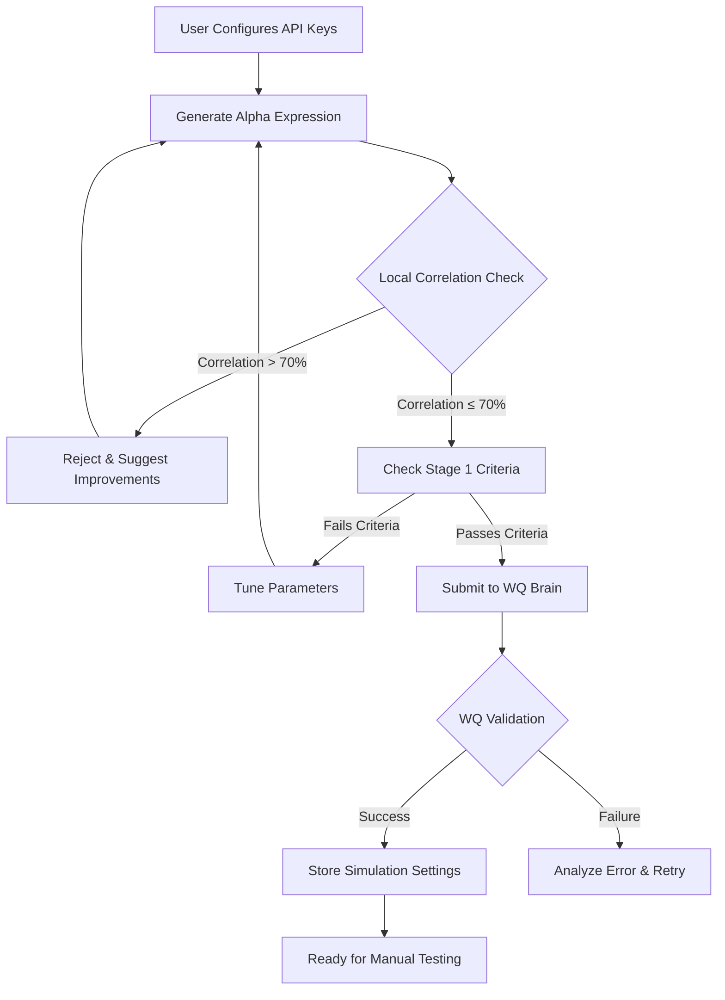

# WorldQuant IQC Stage 1 - Alpha Generator & Self-Correlation Checker

A Streamlit-based application for generating, testing, and submitting alpha expressions to WorldQuant Brain API with **local self-correlation checking** to avoid wasting time on correlated alphas.

## 🚀 Key Features

### 1. Local Self-Correlation Checker (Critical!)
- **Runs BEFORE submission** to WorldQuant
- Prevents wasting API calls on correlated alphas (>70% correlation)
- Implements the "10% Sharpe Exception" rule automatically
- Uses expression structural similarity and pattern matching
- Saves time by filtering out bad candidates early

### 2. AI-Powered Alpha Generation
- **Multiple AI Providers**: OpenAI, NVIDIA, OpenCode (user provides API keys)
- Generates diverse alpha expressions using 66+ verified WQ operators
- 6 Strategy Types: Mean Reversion, Momentum, Volume-Price, Volatility, Correlation, Custom
- Continuous improvement loop based on feedback

### 3. WorldQuant Integration
- Secure credential management (encrypted storage)
- Automatic authentication and session handling
- Concurrent simulation limit management (5-10 active runs)
- Real-time status tracking of submissions

### 4. Stage 1 Compliance Validation
Automatically checks against IQC 2026 criteria:
- **Sharpe Ratio**: ≥ 1.25
- **Fitness**: ≥ 1.0
- **Turnover**: 1% - 70%
- **Sub-universe Sharpe**: ≥ 0.73
- **Margin**: > 0

### 5. Simulation Settings Generator
For successful alphas, automatically generates:
- Region and Universe settings
- Decay and Truncation parameters
- Neutralization options
- Ready-to-copy configuration for WQ Brain

## 📋 Prerequisites

```bash
pip install streamlit requests pandas numpy sqlite3 cryptography
```

## 🔧 Setup Instructions

### 1. Install Dependencies
```bash
pip install -r requirements.txt
```

### 2. Run the Application
```bash
streamlit run app.py --server.port 8502
```

Access the dashboard at: `http://localhost:8502`

### 3. Configure Your Settings

#### AI Provider API Keys (Sidebar)
Enter your preferred provider's API key:
- **OpenAI**: For GPT-4, GPT-3.5-turbo
- **NVIDIA**: For Llama3-70B, other NVIDIA models
- **OpenCode**: For open-source models

#### WorldQuant Credentials (Sidebar)
- Enter your WorldQuant Brain email and password
- Credentials are encrypted and stored locally
- Support for multiple user accounts

## 🎯 How It Works

### Workflow Overview



### Step-by-Step Process

1. **Configuration Phase**
   - User enters AI provider API key in sidebar
   - User enters WorldQuant credentials in sidebar
   - System initializes database and loads history

2. **Alpha Generation**
   - AI generates diverse alpha expressions
   - Multiple strategies rotated to ensure diversity
   - Expressions use verified WQ operators only

3. **Local Pre-Validation (CRITICAL)**
   - **Self-Correlation Check**: Compares against all submitted alphas
     - Calculates Jaccard similarity on expression tokens
     - Analyzes parameter distances
     - Checks function pattern overlaps
     - If correlation > 70%: Checks if Sharpe is 10% higher (exception rule)
   - **Stage 1 Criteria Check**: Validates thresholds before submission
   - Only proceeds if BOTH checks pass

4. **WorldQuant Submission**
   - Authenticates with WQ Brain API
   - Manages concurrent simulation limits
   - Submits alpha for official validation
   - Monitors status and retrieves results

5. **Result Processing**
   - If successful: Stores alpha with simulation settings
   - If failed: Analyzes error message and adjusts generation strategy
   - Updates local correlation database for future checks

## 📊 Stage 1 IQC 2026 Requirements

Your alpha MUST meet these thresholds:

| Metric | Requirement | Description |
|--------|-------------|-------------|
| **Sharpe Ratio** | ≥ 1.25 | Risk-adjusted return measure |
| **Fitness** | ≥ 1.0 | Combines Sharpe, returns, and turnover |
| **Turnover** | 1% - 70% | Daily portfolio trade percentage |
| **Sub-universe Sharpe** | ≥ 0.73 | Performance across stock subsets |
| **Margin** | > 0 | Positive expected profit |

### Hard Operational Limits

- **Concurrent Simulations**: 5-10 active runs maximum
- **Correlation Threshold**: 70% (0.70)
  - Exception: Accepted if Sharpe is 10% higher than correlated alpha
- **Expression Length**: Must fit within WQ Brain character limits

## 🛠️ Core Components

### `app.py`
Main Streamlit application with:
- Sidebar configuration panel
- Alpha generation interface
- Real-time status dashboard
- Results visualization
- Simulation settings display

### `self_correlation_checker.py`
Local correlation prediction engine:
- Token-based Jaccard similarity
- Parameter distance analysis
- Function pattern matching
- 10% Sharpe exception logic
- Diversification suggestions

### `alpha_generator.py`
AI-powered expression generator:
- Multi-provider support (OpenAI, NVIDIA, OpenCode)
- Strategy rotation for diversity
- Operator validation
- Historical learning from failures

### `wq_api_client.py`
WorldQuant Brain API integration:
- Secure authentication
- Session token management
- Simulation submission
- Status monitoring
- Error handling

### `database.py`
SQLite-based persistence:
- Submitted alphas storage
- Credential encryption
- API key management
- Historical tracking

## 💡 Usage Tips

### Maximizing Alpha Diversity
1. Rotate between different AI providers
2. Use different strategy types in succession
3. Adjust temperature/creativity settings
4. Review correlation scores before generation

### Avoiding Common Pitfalls
- ❌ Don't submit without local correlation check
- ❌ Don't ignore turnover constraints
- ❌ Don't exceed concurrent simulation limits
- ✅ Always verify Stage 1 criteria first
- ✅ Monitor correlation trends over time
- ✅ Keep detailed logs of failed attempts

### When Correlation is High (>70%)
The system will suggest:
- Changing core operators (e.g., `ts_mean` → `ts_median`)
- Adjusting lookback periods (e.g., `delay_5` → `delay_10`)
- Switching strategy type (e.g., momentum → mean reversion)
- Adding neutralization factors
- Modifying universe restrictions

## 🔒 Security Notes

- All credentials are encrypted using `cryptography` library
- API keys stored locally in SQLite database
- No credentials sent to third-party services except required APIs
- Session tokens managed securely with automatic refresh
- Password hashing for local storage

## 📈 Continuous Improvement Loop

The system learns from each iteration:
1. Tracks which operators lead to successful alphas
2. Records correlation patterns to avoid repeats
3. Adjusts generation prompts based on failures
4. Builds a knowledge base of effective strategies
5. Optimizes for Stage 1 specific requirements

## 🎓 Stage 1 to Stage 2 Progression

Once you successfully submit alphas that pass all checks:
- System tracks submission count
- Monitors acceptance rate
- Prepares transition to Stage 2 requirements
- Archives successful patterns for future reference

## 🐛 Troubleshooting

### "Limit of Concurrent Simulations" Error
- Wait for existing simulations to complete
- Cancel stuck runs manually in WQ Brain
- System automatically detects and waits

### "Correlation Too High" Error
- Review local correlation checker suggestions
- Try different AI provider or strategy type
- Increase diversity in operator selection
- Consider the 10% Sharpe exception rule

### Authentication Failures
- Verify credentials in sidebar
- Check for typos in email/password
- Ensure no extra spaces in input fields
- Re-authenticate if session expired

## 📝 Example Successful Alpha

```python
# Example: Mean Reversion Strategy
alpha = ts_rank(ts_delta(close, 5), 250) * -1

# Simulation Settings:
# Region: USA
# Universe: TOP3000
# Decay: 20
# Truncation: 0.1
# Neutralization: None
```

## 🤝 Contributing

This tool is designed for IQC 2026 Stage 1 participants. Feel free to:
- Add new strategy types
- Improve correlation detection algorithms
- Enhance AI prompt engineering
- Optimize for specific regions/universes

## 📄 License

For educational purposes related to WorldQuant IQC competition.

## 🙏 Disclaimer

- This tool does NOT guarantee alpha acceptance
- Always verify results manually before final submission
- WorldQuant Brain API usage subject to their terms of service
- Local correlation check is predictive, not definitive
- Final correlation determined by WorldQuant platform

---

**Ready to start generating alphas?** Launch the app and configure your API keys!

```bash
streamlit run app.py --server.port 8502
```

Good luck with IQC Stage 1! 🚀
